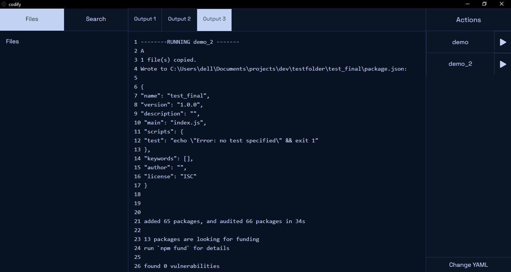

# Codify

An app that simplifies task automation and presents it super clearly.

It automatically converts automations to buttons with forms for data entry and shows live terminal output in neatly organised tabs



## Features

1. [YAML file configuration](#yaml-file-configuration)
2. Clean UI
3. [Automated tasks](#automated-tasks)
4. Startup tasks **todo** 
5. Simple explorer **todo** 
6. Inbuilt CLI. **todo** 
7. Fast search **todo**

## Design

The design has to be as simple and easy on the eyes as possible.
Therefore, there will be as little colors possible(of course that will be customizable too)

## Technical details

The app has to be cross platform, super fast and most importantly, lightweight.

### YAML file configuration 

All automations and app data will be stored in a single YAML file with easy syntax.

Here's a sample:

```yaml
# All subfolders will be made in this directory
baseLocation: C:/Users/dell/Documents/projects/dev
# These are the subfolders/ subcategories in which projects are made
# The 'name' will be used in a templates' 'type' argument
folders:
  - name: node.js
    folder: 'nodejs'
# Just sequences of actions to do
# Eg. Setup workspace by opening Chrome, VS Code, Terminal etc.
actions:
  - name: demo action
    arguments: # arguments are fields which require manualinput in order to run the action
      - name
    commands:
      - echo this is a sample action
      - echo hello $name #argument is specified like this
  - name: demo2
    arguments:
      - age
    commands:
      - echo Your age is $age
# Here, templates for projects are made
# They will be automatically be setup since u specify what the category of the project is and the steps
# A new folder with the name specified will automatically be made and all commands are run in it
procedures:
  - name: Basic node.js
    arguments:
      - name
      - type
    commands:
      - npm init -y
```

#### Parts of the YAML file

##### Base Location

All subfolders/categories will be made in this folder.

##### Folders

These are subfolders/categories in which each project will be created at the [base location](#base-location).

##### Actions

This is where all the automation is done. More on that in [Automated tasks](#automated-tasks).

Some tasks can be configured to run the moment the app is opened (Startup tasks). 

##### Project Templates **todo** 

These will be a special type of action for making projects. Each of these will be made in one of the [folders](#folders) that were made.

### Automated tasks

Here is an example of how tasks will be configured: 

```yaml
actions:
  - name: demo action
    arguments: # arguments are fields which require manualinput in order to run the action
      - name
    commands:
      - echo this is a sample action
      - echo hello $name #argument is specified like this
  - name: demo2
    arguments:
      - age
    commands:
      - echo Your age is $age
```

Each action has the following properties:
- **Name**: A unique name which will be used on the button on the UI
- **Arguments**: Variables that the user needs to enter such as project name, author, path etc.
- **Commands**: This contains a list of CLI commands to execute. Arguments are specified with a `$` preceding it. For using arguments as file names, no other change is required. It can be written as `$argument.txt` 

### Startup tasks
TODO

## Authors

- [@Akshay-VK](https://www.github.com/Akshay-VK)


## Acknowledgements

 - [Tauri](https://tauri.dev)
 - [SvelteKit](https://kit.svelte.dev)
 - [Material UI for Svelte](https://ktibow.github.io/m3-svelte/)


## License

[GNU General Public License v3.0](https://github.com/Akshay-VK/Codify/blob/master/LICENSE)

